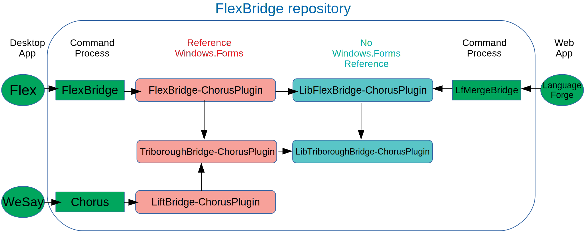

# FLEx Bridge

**FLEx Bridge** is an add-on to FieldWorks (<https://software.sil.org/fieldworks/>; <https://github.com/sillsdev/FwDocumentation/wiki>)
that supports using Chorus (<https://github.com/sillsdev/chorus>) to allow multiple users to share data.

## Architecture

The "big idea" for the bridge system is that clients do not have to know how talk to *Chorus* directly to do Send/Receive(S/R), or even know that *Chorus* is involved. The architecture allows for any number of "bridges" between clients and *Chorus*, with a new bridge being needed for each major kind of xml data (e.g., *LIFT* or *FLEx*'s fwdata). Each bridge needs to define *Handlers* for the xml file extensions it will have in its data. *Chorus* uses those handlers in its work. Each bridge also needs to define *Actions*, which are the kinds of things it wants to do for S/R.

*Language Forge* (LF) uses *LfMergeBridge* to S/R the full *FLEx* data set (LCModel, fwdata file). LF needs a *Windows.Forms*-free environment since it runs on a server.

*FLEx* uses *FLEx Bridge* to S/R its own data set and for *LIFT* (also compatible with *WeSay*). *WeSay* talks directly to *Chorus* and does not use *FLEx Bridge*.

The *TriboroughBridge* project (named after the RFK Triborough Bridge complex connecting three boroughs in New York) contains pieces that are applicable to both *FLEx Bridge* (Full LCModel) and *LiftBridge* (*LIFT* model, also compatible with *WeSay*).

See diagram:


## Development

### Setup

FLEx Bridge depends on several assemblies from Chorus and Palaso. Those are installed from nuget.org.

#### Connecting FieldWorks to FLEx Bridge

- On **Windows**, add the following keys to your registry (32-bit OS: omit 'Wow6432Node\'):

  ```
  [HKEY_LOCAL_MACHINE\SOFTWARE\Wow6432Node\SIL\Flex Bridge\9]
      "InstallationDir"="C:\Dev\flexbridge\output\Debug\net461"
  ```

- On **Linux**, `export FLEXBRIDGEDIR=${HOME}/fwrepo/flexbridge/output/Debug/net461`

### Build

You should be able to build solution `FLExBridge.sln` from Visual Studio 2022 Community Edition or JetBrains Rider.

You can also build and run tests on both Windows and Linux from the command line by running:

```bash
cd build
msbuild /t:Test FLExBridge.proj
```

### Building client projects against locally-built artifacts

- Set an enviroment variable `LOCAL_NUGET_REPO` with the path to a folder on your computer (or local network) to publish locally-built packages
- See [these instructions](https://docs.microsoft.com/en-us/nuget/hosting-packages/local-feeds) to enable local package sources
- `build /t:pack` will pack nuget packages and publish them to `LOCAL_NUGET_REPO`

Further instructions at <https://github.com/sillsdev/libpalaso/wiki/Developing-with-locally-modified-nuget-packages>

## Updating Release Notes for a new version

FLEx Bridge is following the gitflow model for branching

When releasing FLEx Bridge be sure to do the following:

1. Update the version and changelogs / release notes by doing the following.

    - Generate a new Product ID GUID in `build/WixPatchableInstaller.targets`

    - Edit `CHANGELOG.md` by editing or adding to the items in the `## [Unreleased]` section. This will be published
      as release notes for users.

    - Run the following build task to fill in debian/changelog and the release notes html from CHANGELOG.md. Replace
      CHANNEL in the below with Alpha, Beta, or Stable. For a pre-release, pass `/p:Release=false` as an additional
      property. Push the results.

      Windows:

      ```cmd
      cd build
      build.bat /t:PreparePublishingArtifacts /p:UploadFolder=CHANNEL
      ```

      Linux:

      ```bash
      cd build && msbuild FLExBridge.proj /t:PreparePublishingArtifacts /p:UploadFolder=CHANNEL
      ```

    - (Ignore this step for now; FLEx Bridge patches cannot be bundled in FLEx patches) Windows: Tag and
    Pin the FLEx Bridge Installer build on TeamCity, then update the FLEx Bridge Patcher build to depend
    on that tag.

    - Tag the commit after the PR is merged e.g. `git tag v3.2.1` and push the tag to the repository.

2. Build

    - The Windows version is released through two jobs on TeamCity: "Installer" and "Patcher". The first three
      version numbers come from the `version` file; the fourth-place version number is always 1 for "Installer"
      and comes from the build counter for "Patcher". If you need to make a fix before publishing a patch, you
      can avoid incrementing the version number by setting the build counter back before rerunning the Patcher
      job.

    - Make a Linux package for release by doing the following:
        - Go to the Jenkins job for this branch of flexbridge.
        - Click Build with Parameters.
        - Change Suite to "main" (or maybe "updates" for a hotfix).
        - Unselect AppendNightlyToVersion.
        - Optionally set Committish to an older commit, such as where the changelog entry was updated.
        - Click Build.
